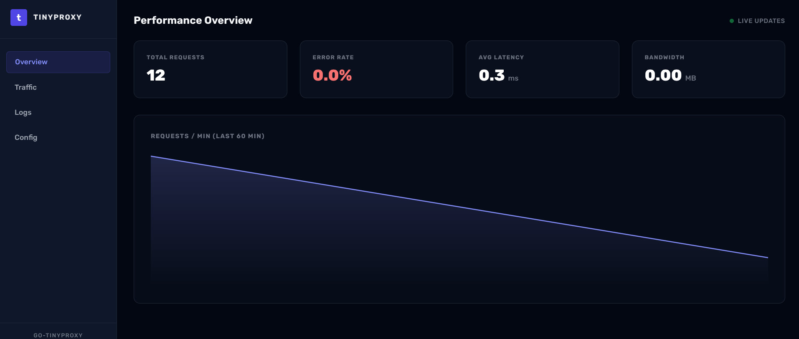
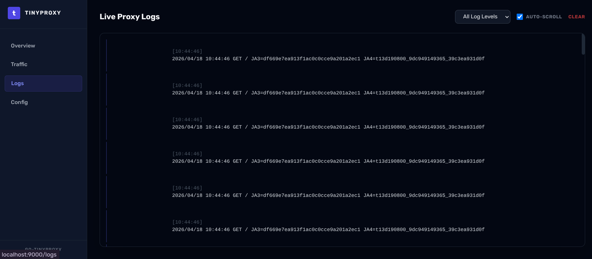
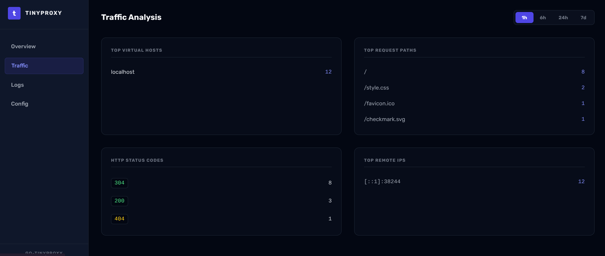
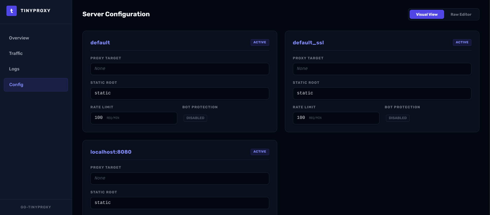

# Admin Dashboard

**tinyproxy** features a built-in administrative dashboard for real-time
observability of your proxy server.

## Features

- **Live Traffic Monitoring**: View requests as they happen.
- **Backend Health**: Status of all configured upstreams.
- **Security Logs**: Visualizing blocked bots and honeypot hits.
- **Configuration Overview**: Inspect current virtual host settings.

## Accessing the Dashboard

The dashboard is enabled via CLI flags on the `serve` subcommand — it is **not**
configured in `vhosts.conf`.

### 1. Create a credentials file

Use `dashboard passwd` to generate a bcrypt-hashed credentials file:

```bash
go-tinyproxy dashboard passwd --output /etc/go-tinyproxy/dashboard.creds
```

### 2. Start the server with the dashboard enabled

```bash
go-tinyproxy serve \
  --enable-dashboard \
  --dashboard-host 127.0.0.1 \
  --dashboard-port 9000 \
  --dashboard-creds /etc/go-tinyproxy/dashboard.creds \
  --dashboard-db /var/lib/go-tinyproxy/dashboard.db
```

| Flag                 | Default        | Description                                                 |
| -------------------- | -------------- | ----------------------------------------------------------- |
| `--enable-dashboard` | `false`        | Enable the admin dashboard                                  |
| `--dashboard-host`   | `127.0.0.1`    | Listen address (non-localhost requires `--dashboard-creds`) |
| `--dashboard-port`   | `9000`         | Listen port                                                 |
| `--dashboard-creds`  | _(none)_       | Path to `username:bcrypt_hash` credentials file             |
| `--dashboard-db`     | `dashboard.db` | Path to the SQLite statistics database                      |
| `--dashboard-cert`   | _(none)_       | TLS certificate for the dashboard (optional)                |
| `--dashboard-key`    | _(none)_       | TLS key for the dashboard (optional)                        |

Once running, visit `http://127.0.0.1:9000` (or the configured host/port) and
log in with your credentials.

## Screenshots

 
 
